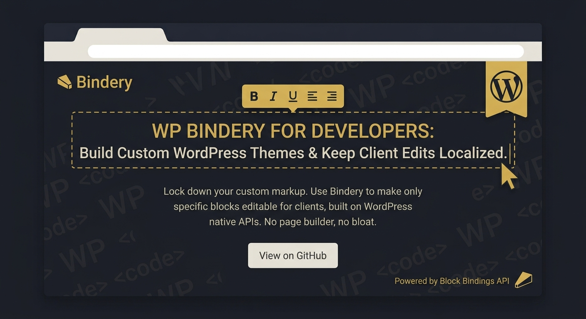

# Bindery



**Make any WordPress theme client-editable — without giving up clean code.**

Bindery lets a developer decide exactly what a non-technical client may change on a
site, then gives that client a locked, multilingual, edit-in-place experience over
**only** those things. The theme keeps its hand-written, performant markup; the
client edits text on the live page like a document; nobody can break the layout.

- **Requires:** WordPress 6.5+ · PHP 8.1+
- **License:** GPL-2.0-or-later
- **Status:** 0.1.0

---

## The problem it solves

You can build a WordPress site two ways:

1. **Hand-coded / AI-generated themes** — fast, clean, fast-loading markup. But the
   content is hardcoded, so the client can't change a headline or a phone number
   without a developer.
2. **Page builders** (Elementor, Bricks, …) — the client can edit everything, but
   the output is bloated, unpredictable markup and the editing surface is a mess.

These have always been mutually exclusive: *clean code* **or** *client-editable*.
**Bindery is the missing middle.** The developer keeps 100% control of the code and
CSS; the client gets a tidy, locked editing surface over exactly what was declared
editable — and nothing else.

It's built entirely on **native WordPress primitives** (the Block Bindings API,
`block.json`, the REST API), so it adds no markup ownership and no builder lock-in.

---

## What you get

- **Edit on the live page.** A floating "✎ Edit page" button turns declared text
  regions into inline-editable fields. Click, type, click away — saved.
- **Five ways to make content editable** (mix and match):
  1. **Settings page, zero code** — tick which HTML tags become editable site-wide.
  2. **Attribute helper** — mark one element in your template editable.
  3. **Blocks** — drop a Bindery block into the block editor.
  4. **Template tags** — render a declared field anywhere in PHP.
  5. **Auto mode** — make *all* existing page text editable automatically.
- **Locked by design.** Only declared regions are editable; structure, layout and
  everything unmarked stay untouchable.
- **Multilingual** out of the box — one field, a value per locale.
- **Revision history + one-click restore** for every edit.
- **Export / import** all values (site migrations, staging → production).
- **Theme-portable** — verified across 10 themes (Astra, OceanWP, Neve, the
  default Twenty-* themes, and block/FSE themes).

---

## How it works (in one minute)

A Bindery **field** is one editable thing — identified by a key (`hero_title`),
with a type (`text`, `richtext`, `url`, `image`, `repeater`, …) and a scope
(`page` = per-page, or `global` = site-wide).

```
declare a field  →  Bindery resolves its value  →  renders clean markup
                     (stored override per locale ?? your code default)
```

- **Values live in their own table** (`wp_bindery_values`), one row per
  *(object, field, locale)* — never mixed into your markup.
- **The default never gets stored.** If the client hasn't edited a field, the value
  is whatever your code says. Once they edit it, the override wins (for that locale).
- **Editing is whitelisted.** The REST endpoint only accepts writes to fields that
  actually appear on the page being edited, each sanitized by its type. A client
  can never write to something you didn't expose.

Architecture is a small DI container + service providers, with four pluggable seams
(field types, value sources, storage adapters, locale providers), all driven by
filters. See [`DEVELOPERS.md`](DEVELOPERS.md) for the internals.

---

## Installation

1. Copy the `bindery` folder into `wp-content/plugins/`.
2. Activate **Bindery** in *Plugins*.

On activation it creates its tables, grants the editing capability
(`bindery_edit_content`) to Administrators and Editors, and adds a **Bindery** item
to the admin menu. (The pre-built JS in `build/` is shipped — you don't need to run
a build to use the plugin. Rebuild only if you change the source: `npm i && npm run build`.)

---

## Using Bindery

### 1. No-code: the Settings page

Go to **wp-admin → Bindery**. This is all a site owner needs:

- **Editable Content** — turn on "Let clients edit existing page text in place" and
  tick which elements are editable: Headings, Paragraphs, List items, Quotes, etc.
  Choose which post types it applies to.
- **Editing Experience** — show/hide the floating button, auto-enter edit mode for
  editors, *strict* mode, and the accent colour.
- **Permissions** — which roles may edit (Administrators always can).
- **History & Data** — keep a revision history (and how many versions per field),
  **Export / Import** all values as JSON, and the delete-data-on-uninstall switch.

With "auto content editing" on, visit any page, click **✎ Edit page**, and start
editing the existing text. Done — no code at all.

### 2. Edit on the live page (the overlay)

For any user with the editing capability, Bindery adds a floating **✎ Edit page**
button on the front end of singular pages. Clicking it:

- outlines every editable region,
- makes them `contenteditable`,
- saves each on blur (per current locale),
- offers a language switcher when more than one locale exists.

Everything not declared editable is left completely alone. Press **✓ Done** to exit.

### 3. Mark one region editable in a hand-coded template

The cleanest path for a developer who owns the theme. You write the markup; Bindery
just prints the hooks and resolves the value.

```php
<h1 <?php bindery_attrs( 'hero_title', array( 'type' => 'h1' ) ); ?>><?php
    echo esc_html( (string) bindery_value( 'hero_title' ) );
?></h1>
```

- `bindery_attrs( $key, $args )` prints `data-bindery-*` attributes **only** for
  capable users (visitors get clean markup) and only if the field isn't locked.
- `bindery_value( $key )` returns the resolved value (override ?? default).

The field is now editable through the front-end overlay and persists per page —
and *nothing else* in that template is touchable.

A global (site-wide) field is identical with `'scope' => 'global'` — edit it once on
any page and it updates everywhere (great for an announcement bar or footer line).

### 4. Render a declared field anywhere (template tags)

```php
// Echo a field rendered + escaped by its type:
bindery_field( 'phone', array( 'type' => 'text', 'default' => '+1 555 0100' ) );

// Get the raw resolved value:
$tagline = bindery_value( 'tagline', array( 'default' => 'Boutique stays.' ) );

// Loop a repeater (e.g. a list of features):
foreach ( bindery_rows( 'features' ) as $row ) {
    echo '<h3>' . esc_html( $row['title'] ) . '</h3>';
    echo '<p>'  . esc_html( $row['body']  ) . '</p>';
}
```

| Function | Purpose |
|---|---|
| `bindery_value( $key, $args, $object_id )` | Resolved value (override ?? default). |
| `bindery_field( $key, $args, $object_id )` | Echo the value rendered + escaped by its type. |
| `bindery_get_field( … )` | Same, returned as a string. |
| `bindery_rows( $key, $args, $object_id )` | Repeater rows for looping. |
| `bindery_attrs( $key, $args, $object_id )` | Print the overlay hooks onto your own tag. |
| `bindery_register_field( $key, $args )` | Declare a field explicitly (e.g. in `functions.php`). |

**Common `$args`:** `type` (`h1`–`h6`, `p`, `span`, `text`, `richtext`, `link`,
`image`, `repeater`, …), `default`, `scope` (`page` | `global`), `locked` (visible
but not editable), `capability`, `label`.

### 5. Blocks (for the block editor)

Bindery ships eight self-contained blocks that store their content in the Bindery
store (per locale) instead of in the post markup:

`editable-text` · `cards` (repeater grid) · `slider` (carousel) · `image` ·
`button` · `icon` · `form` (with submissions + spam protection) · `section`
(background image + inner blocks).

Their colours adapt to the active theme via `--bindery-*` CSS variables (with
neutral fallbacks), so they look native anywhere; a theme can set those variables
to apply its own palette. There are also ready-made **block patterns** (Hero,
Features, Testimonials, Contact, full Landing page) under the "Bindery" category.

### 6. Multilingual

Every field is locale-aware by default. The overlay's language switcher reloads the
page in a locale and edits store a value per locale; unedited locales fall back to
your code default. Plug in WPML/Polylang via the `bindery/locale_provider` filter,
or use the built-in provider with a `?lang=` parameter.

---

## History, restore, export & import

Every edit is recorded with who changed it and when (capped per field, configurable).

**From the Settings page:** History tab → **Export values (JSON)** to download a full
snapshot, or pick a file to **Import**.

**From WP-CLI:**

```bash
wp bindery export --file=values.json          # export all values to JSON
wp bindery import --file=values.json           # import (history-suppressed)
wp bindery history hero_title --object=9 --locale=en_US   # list versions
wp bindery restore 42                          # restore a field to version #42
```

Imports are sanitised (`wp_kses_post`) and bounded, so a hand-edited file can't
inject scripts or exhaust storage.

---

## Security model

- **Capability-gated.** Editing requires `bindery_edit_content`; the settings page
  and its REST routes require `manage_options`. Administrators always retain the
  editing capability.
- **Whitelisted writes.** The editor REST endpoint accepts writes only for fields
  present on the page (discovered from its own blocks/markup), rejects `locked`
  fields, and re-checks the per-field capability.
- **Sanitized in, escaped out.** Each field type sanitizes on save and escapes on
  render (`esc_html`, `wp_kses_post`, `esc_url`…). Auto-marked text is stored as
  plain text and rendered via `textContent`, so injected HTML is neutralised.
- **Visitors get clean markup.** The `data-bindery-*` hooks and the overlay assets
  are emitted only for capable, logged-in users.

---

## Developer reference

### Key filters

| Filter | What it controls |
|---|---|
| `bindery/settings` | Override any resolved setting in code (wins over the UI). |
| `bindery/auto_editable` | Enable/disable auto content editing per post. |
| `bindery/strict_overlay` | Overlay edits only hand-coded regions, not blocks. |
| `bindery/storage_adapter` | Swap the storage backend (table, meta, custom). |
| `bindery/cache_storage` | Toggle the per-request value cache. |
| `bindery/locale_provider` | Provide locales (WPML/Polylang adapter). |
| `bindery/record_history` / `bindery/history_cap` | History on/off and version cap. |
| `bindery/lock_editor` / `bindery/lock_mode` | Lock the block editor's structure. |

### Actions

`bindery/register` (register custom field types/sources), `bindery/booted`,
`bindery/activated`, `bindery/form_submitted`.

### Extending

The four registries (field types, value sources, storage adapters, locale
providers) are all filter-driven — add your own without forking. See
[`DEVELOPERS.md`](DEVELOPERS.md) for interfaces and examples.

---

## How values resolve (precedence)

```
stored override for the current locale   (any value the client saved — even "")
  └─ else: the default you passed in code
```

The default is **never** persisted, so improving it in code reaches every site that
hasn't overridden the field. A field is only as editable as you declare it: remove
the declaration and the value quietly falls back to your code — nothing is ever
orphaned in the page markup. (You can reshape this rule with the
`bindery/resolve_value` filter or a custom value source.)

---

## Requirements & build

- WordPress 6.5+, PHP 8.1+.
- Runtime needs no Composer (a tiny PSR-4 autoloader ships in the plugin) and no
  build (the compiled JS is in `build/`).
- For development: `composer install` (PHPUnit, PHPStan, PHPCS) and `npm install`
  (the `@wordpress/scripts` build). Quality gates: `composer test`,
  `composer phpstan`, `composer lint`, `npm run build`.

---

## License

GPL-2.0-or-later. See the plugin header for details.
